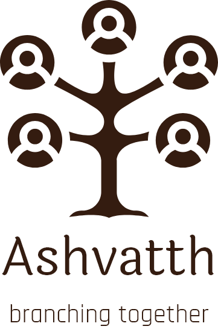

  

# Ashvatth

<em> Ashvatth is an application which creates one's family tree easily and automatically. It is a simple app yet its benefits are multiple. Ashvatth is a Sanskrit word for Peepal tree, also known as Bodhi Vriksha. ( A knowledge giving tree.) As the Ashvatth tree grows, it develops hundreds of branches. The app does the same. When a person registers his full name and info on the app it automatically connects him to his entire family or clan from his father's side as well as mother's side. As the members add up, the app automatically forms a family tree and fixes every member's position on the branch. Thus the information of a person's ancestors or descendants can be traced by him or other members. 
Besides infotainment this app can weave an entrepreneurial network among family members and leads to the creation of a mini marketplace. Ashvatth acts as a storage where references, photographs, videos and memories can be stored securely. Health tracking, monitoring, consultation and quick response in an emergency  are some  future possible modules in the development. Everyone is interested to know and preserve their roots and family history. This app helps in the task by keeping every member in contact and strengthens the bonds of a family.</em>

### Running the app

- <strong>Ashvatth</strong> is currenly not published on the play store and the app store. 

- You can launch the app by installing the apk provided on the repository.
- For running the app, It will require a <strong>google-services.json</strong> file with your <strong>SHA Keys</strong>.
- <strong> Create a firebase project , add your SHA keys and download the google-services.json to replace it in the source code. </strong>
